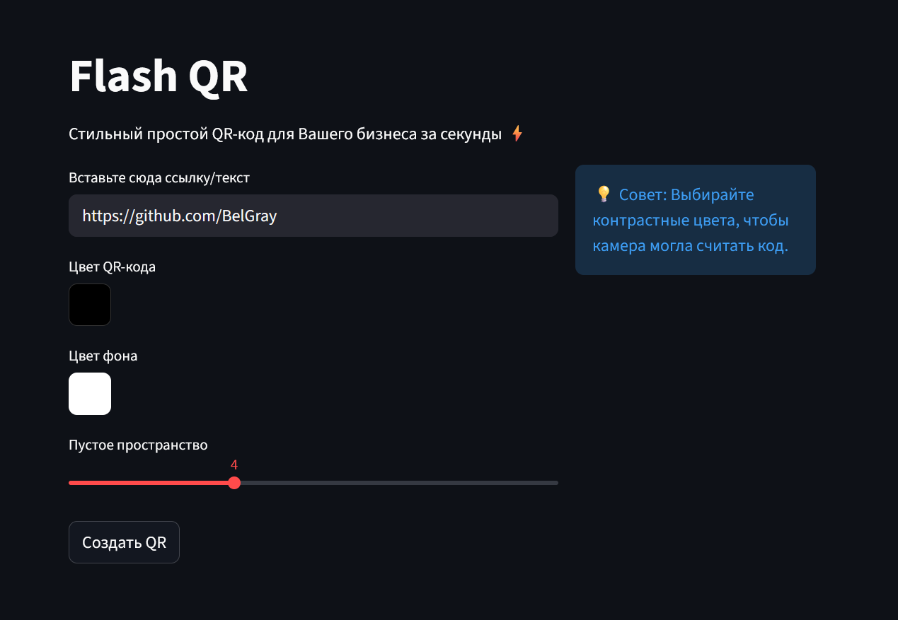
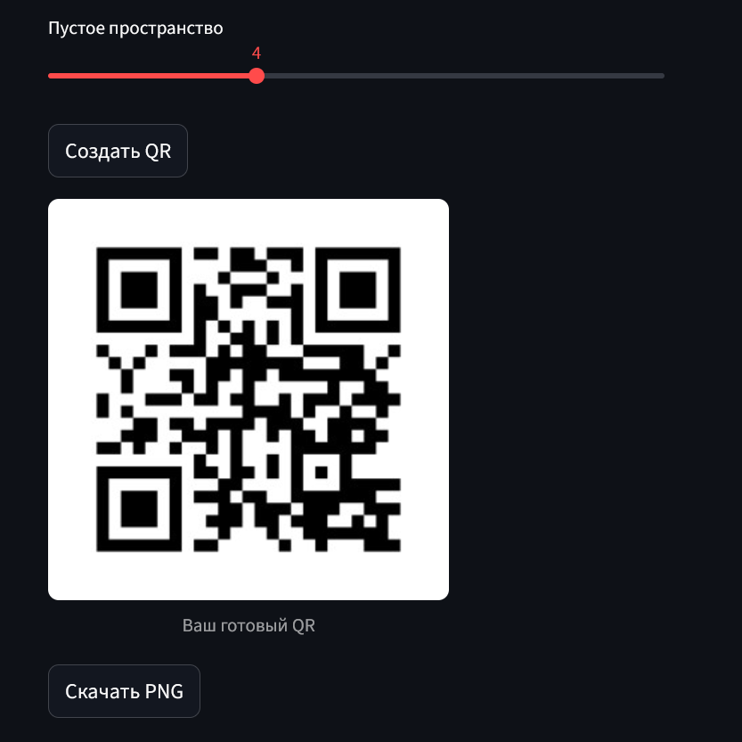

# FlashQR ⚡
## Минималистичный сервис для генерации простых QR-кодов

### Генерация в 3 шага
1. **Вставьте ссылку на Ваш ресурс**
2. **Настройте три самых важный параметра: цвет кода, цвет фона и отступы**
3. **Нажмите кнопку создания QR**

В результате получается стильный серьезный QR, созданный меньше, чем за минуту. Готовый QR можно скачать в формате PNG.

